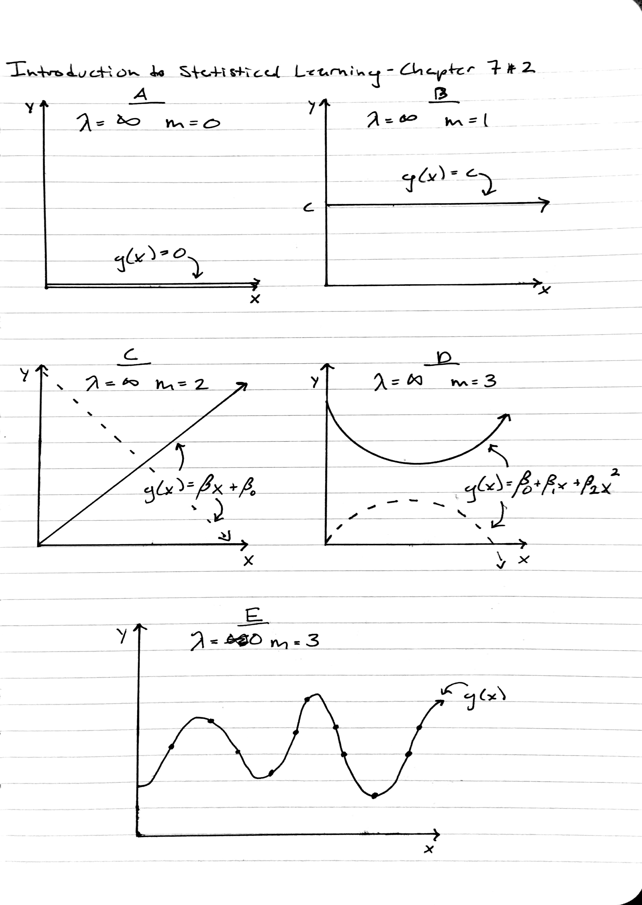

# Conceptual

## 1

* **A**. The cubic piecewise polynomial:

$$
f(x) = \beta_0 + \beta_1x + \beta_2x^2 + \beta_3x^3 + \beta_4(x - \xi)^3_+ ~~~ 
where ~~~ (x - \xi)^3_+ = 
\begin{cases}
0, ~~~ x \le \xi \\ 
(x - \xi)^3, ~~~ otherwise
\end{cases}
$$

\setlength{\leftskip}{1cm}

...can be broken up and rewritten to be:

$$
f(x) = 
\begin{cases}
f_1(x) = a_1 + b_1x + c_1x^2 + d_1x^3, ~~~ x \le \xi \\ 
f_2(x) = a_2 + b_2x + c_2x^2 + d_2x^3, ~~~ otherwise
\end{cases}
$$

In $f_1(x)$, since $(x - \xi)^3_+ = 0$ (because $x \le \xi$), the fifth term (of $f(x)$) zeroes out and the coefficients can be expresses as $a_1 = \beta_0, ~b_1 = \beta_1, ~c_1 = \beta_2$ and $d_1 = \beta_3$.

\setlength{\leftskip}{0cm}

\hfill

* **B**. Expanding the fifth term in $f(x)$ allows for the various powers of $x$ to be grouped together and then recondensed. $a_2, ~b_2, ~c_2$ and $d_2$ are expressed in terms of the cofficients below.

\begin{align}
f_2(x) & = \beta_0 + \beta_1x + \beta_2x^2 + \beta_3x^3 + \beta_4(x - \xi)^3 \\
& = \beta_0 + \beta_1x + \beta_2x^2 + \beta_3x^3 + \beta_4(x - \xi)(x - \xi)(x - \xi) \\
& = \beta_0 + \beta_1x + \beta_2x^2 + \beta_3x^3 + \beta_4(x^2 - 2x\xi + \xi^2)(x - \xi) \\
& = \beta_0 + \beta_1x + \beta_2x^2 + \beta_3x^3 + \beta_4(x^3 -x^2\xi - 2x^2\xi + 2x\xi^2 + \xi^2x - \xi^3) \\
& = \beta_0 + \beta_1x + \beta_2x^2 + \beta_3x^3 + \beta_4(x^3 -3x^2\xi + 3x\xi^2 - \xi^3) \\
& = \beta_0 + \beta_1x + \beta_2x^2 + \beta_3x^3 + \beta_4x^3 -\beta_43x^2\xi +\beta_4 3x\xi^2 - \beta_4\xi^3 \\
& = (\beta_0  - \beta_4\xi^3) + (\beta_1x + \beta_4 3x\xi^2) + (\beta_2x^2 - \beta_43x^2\xi) + (\beta_3x^3 + \beta_4x^3) \\
& = (\beta_0 - \beta_4\xi^3) + (\beta_1 + 3\beta_4\xi^2)x + (\beta_2 - 3\beta_4\xi)x^2 + (\beta_3 + \beta_4)x^3 \\
f_2(x) & = a_2 + b_2x + c_2x^2 + d_2x^3 ~~~ where ~~~ \begin{cases}
                                                    a_2 = \beta_0 - \beta_4\xi^3 \\
                                                    b_2 = \beta_1 + 3\beta_4\xi^2 \\
                                                    c_2 = \beta_2 - 3\beta_4\xi \\
                                                    d_2 = \beta_3 + \beta_4
                                                    \end{cases}
\end{align}

\pagebreak

* **C**. Showing that $f(x)$ is continuous at $\xi$ is illustrated by showing that $f(\xi)_1 = f(\xi)_2$.

\begin{align}
f_1(\xi) & = a_1 + b_1(\xi) + c_1(\xi)^2 + d_1(\xi)^3 \\
& = \beta_0 + \beta_1(\xi) + \beta_2(\xi)^2 + \beta_3(\xi)^3 \\
\\
f_2(\xi) & = a_2 + b_2(\xi) + c_2(\xi)^2 + d_2(\xi)^3 \\
& = (\beta_0 - \beta_4\xi^3) + (\beta_1 + 3\beta_4\xi^2)(\xi) + (\beta_2 - 3\beta_4\xi)(\xi)^2 + (\beta_3 + \beta_4)(\xi)^3 \\
& = (\beta_0 - \beta_4\xi^3) + (\beta_1\xi + 3\beta_4\xi^3) + (\beta_2\xi^2 - 3\beta_4\xi^3) + (\beta_3\xi^3 + \beta_4\xi^3) \\
& = \beta_0 - \beta_4\xi^3 + \beta_1\xi + 3\beta_4\xi^3 + \beta_2\xi^2 - 3\beta_4\xi^3 + \beta_3\xi^3 + \beta_4\xi^3 \\
& = \beta_0 + \beta_1\xi + \beta_2\xi^2 + \beta_3\xi^3 + 3\beta_4\xi^3 - 3\beta_4\xi^3 + \beta_4\xi^3 - \beta_4\xi^3 \\
& = \beta_0 + \beta_1\xi + \beta_2\xi^2 + \beta_3\xi^3 + (3\beta_4\xi^3 - 3\beta_4\xi^3) + (\beta_4\xi^3 - \beta_4\xi^3) \\
f_2(\xi) & = \beta_0 + \beta_1\xi + \beta_2\xi^2 + \beta_3\xi^3
\end{align}

$$
f_2(\xi) = \beta_0 + \beta_1\xi + \beta_2\xi^2 + \beta_3\xi^3 = f_1(\xi)
$$

\hfill

* **D**. In order to show that $f'_1(\xi) = f'_2(\xi)$, we must first find $f'(x)$ with respect to $x$ and then simplify both $f'_1(\xi)$ and $f'_2(\xi)$.

\begin{align}
f(x) & = a_1 + b_1x + c_1x^2 + d_1x^3 \\
f'(x) & = b_1 + 2c_1x + 3d_1x^2
\end{align}

\setlength{\leftskip}{1cm}

Therefore, substituting the necessary coefficients in for $b_1, ~c_1$ and $d_1$ in both $f'_1(\xi)$ and $f'_2(\xi)$, we get:

\begin{align}
f'(x) & = b_1 + 2c_1x + 3d_1x^2 ~~~ then ~~~ \begin{cases}
                                            f'_1(\xi) = \beta_1 + 2\beta_2\xi + 3\beta_3\xi^2 \\
                                            f'_2(\xi) = (\beta_1 + 3\beta_4\xi^2) + 2(\beta_2 - 3\beta_4\xi )\xi + 3(\beta_3 + \beta_4)\xi^2
                                              \end{cases}
\end{align}

\begin{align}
f'_2(\xi) & = (\beta_1 + 3\beta_4\xi^2) + 2(\beta_2 - 3\beta_4\xi )\xi + 3(\beta_3 + \beta_4)\xi^2 \\
& = \beta_1 + 3\beta_4\xi^2 + 2\beta_2\xi - 6\beta_4\xi^2 + 3\beta_3\xi^2 + 3\beta_4\xi^2 \\
& = \beta_1 + 2\beta_2\xi + 3\beta_3\xi^2 + (3\beta_4\xi^2 + 3\beta_4\xi^2 - 6\beta_4\xi^2) \\
& = \beta_1 + 2\beta_2\xi + 3\beta_3\xi^2 + (6\beta_4\xi^2 - 6\beta_4\xi^2) \\
f'_2(\xi) & = \beta_1 + 2\beta_2\xi + 3\beta_3\xi^2
\end{align}


We now see that the derivative $f'(x)$ is continuous at knot $\xi$, which is to say $f'_1(\xi) = f'_2(\xi)$:

$$
f'_2(\xi) = \beta_1 + 2\beta_2\xi + 3\beta_3\xi^2 = f'_1(\xi)
$$

\setlength{\leftskip}{0cm}

\pagebreak

* **E**. In order to show that $f''_1(\xi) = f''_2(\xi)$, we must first find $f''(x)$ with respect to $x$ and then simplify both $f''_1(\xi)$ and $f''_2(\xi)$.

\begin{align}
f(x) & = a_1 + b_1x + c_1x^2 + d_1x^3 \\
f'(x) & = b_1 + 2c_1x + 3d_1x^2 \\
f''(x) & = 2c_1 + 6d_1x
\end{align}

\setlength{\leftskip}{1cm}

Therefore, substituting the necessary coefficients in for $c_1$ and $d_1$ in both $f''_1(\xi)$ and $f''_2(\xi)$, we come to:

\begin{align}
f''(x) & = 2c_1 + 6d_1x ~~~ then ~~~ \begin{cases}
                                    f''_1(\xi) = 2\beta_2 + 6\beta_3\xi \\
                                    f''_2(\xi) = 2(\beta_2 - 3\beta_4\xi) + 6(\beta_3 + \beta_4)\xi
                                     \end{cases}
\end{align}

\begin{align}
f''_2(\xi) & = 2(\beta_2 - 3\beta_4\xi) + 6(\beta_3 + \beta_4)\xi \\
& = 2\beta_2 - 6\beta_4\xi + 6\beta_3\xi + 6\beta_4\xi \\
& = 2\beta_2 + 6\beta_3\xi + (6\beta_4\xi - 6\beta_4\xi) \\
f''_2(\xi) & = 2\beta_2 + 6\beta_3\xi
\end{align}

We now see that the second derivative $f''(x)$ is continuous at knot $\xi$, which is to say $f''_1(\xi) = f''_2(\xi)$:

$$
f''_2(\xi) = 2\beta_2 + 6\beta_3\xi = f''_1(\xi)
$$

\setlength{\leftskip}{0cm}

## 2

(sketches on following page)

* **A**. With $\lambda = \infty$, the second term will dominate the above equation and the RSS will be ignored. Since $g^0 = g$, this comes out to finding $g(x)$ that minimizes the integral of $g(x)$. Therefore, $g(x) = 0$.

* **B**. With $\lambda = \infty$ and $m = 1$, the second term will dominate the above equation and the RSS will be ignored. This then becomes a problem of finding a function $g(x)$ where $\int g'(x)$ is minimized. Therefore, $g(x) = c$ (a flat line) where $c$ is a constant, ensuring that $g'(x) = 0$.

* **C**. With $\lambda = \infty$ and $m = 2$, the second term will dominate the above equation and the RSS will be ignored. This then becomes a problem of finding a function $g(x)$ where $\int g''(x)$ is minimized.

\setlength{\leftskip}{1cm}

If we work backwards conceptually, we will see that $g(x) = \beta_0 + \beta_1 x$. Since $\int g''(x)$ must be minimized, $g''(x) = 0$. Therefore, $g'(x) = c$ where $c$ is some constant. This implies that $g(x)$ must have a constant slope, $c$ aka $\beta_1$. Therefore, $g(x) = \beta_0 + \beta_1 x$

\setlength{\leftskip}{0cm}

* **D**. With $\lambda = \infty$ and $m = 3$, the second term will dominate the above equation and the RSS will be ignored. This then becomes a problem of finding a function $g(x)$ where $\int g'''(x)$ is minimized. Therefore, $g(x) = \beta_0 + \beta_1x + \beta_2x^2$, $g(x)$ will be quadratic in some sense

\setlength{\leftskip}{1cm}

Once again, working backwards conceptually, if the goal is to minimize $\int g'''(x)$, then $g'''(x) = 0$. Therefore, $g''(x) = c$, where $c$ is some constant. This implies that $g'(x)$ must have a constant slope, $c$. if $g'(x)$ has a constant slope, then $g(x) = \beta_0 + \beta_1x + \beta_2x^2$. Having a quadratic equation means that the slope of $g(x)$ is changing at a fixed rate, which satisfies our condition that $g'(x) = c$. 

\setlength{\leftskip}{0cm}

* **E**. With $\lambda = 0$ and $m = 3$, the second term in the equation is completely ignored, and $g(x)$ becomes the line that interpolates all data points.



## 3

$$
f(x) = 1 + x +  \begin{cases}
                -2(x - 1)^2,~ x \ge 1 \\
                0, ~otherwise
                \end{cases}
$$

The intercept is at $y = 1$, $f(x)$ is linear with a slope equal to 1 up to $x = 1$, after which it becomes quadratic.

\hfill

```{r, echo=FALSE}
x <- -2:2
y <- 1 + x + (-2*(x-1)^2 * I(x >= 1))
plot(x, y, type = 'l', main = "f(x)")
points(0,1, pch = 16)
text(0.5,1,labels = 'Intercept (0, 1)')
```

\pagebreak

## 4

\begin{align}
f(x) & = \beta_0 + \beta_1b_1(x) + \beta_2b_2(x) \\
f(x) & = 1 + b_1(x) + 3b_2(x) ~~~ where ~~~
\begin{cases}
    b_1(x) = I(0 \leq x \leq 2) - (x - 1)I(1 \leq x \leq 2) \\
    b_2(x) = (x - 3)I(3 \leq x \leq 4) + I(4 < x \leq 5)
\end{cases}
\end{align}

```{r}
x <- -2:2
y <- c(1,1,2,2,1)
plot(x, y)
```

## 5

\begin{align}
\hat{g_1} & = \left( \sum_{i=1}^n (y_i - g(x_i))^2 + \int[g^3(x)]^2dx \right) \\
\hat{g_2} & = \left( \sum_{i=1}^n (y_i - g(x_i))^2 + \int[g^4(x)]^2dx \right)
\end{align}

* **A**. As $\lambda \to \infty$, $\hat{g_2}$ will have a smaller training RSS. This is because $\hat{g_2}$ has one more degree of freedom than $\hat{g_1}$; in other words, it is allowed to be more flexible thatn $\hat{g_1}$.

* **B**. As $\lambda \to \infty$, $\hat{g_1}$ will most likely have a lower test RSS, although this is less certain than part **A**. It will most likely have a lower test RSS because we are constraining it more, which is to say there is less of a chance that it incorporates the error term $\epsilon$ into the model itself.

* **C**. If $\lambda = 0$, the two equations are the same so they will have the same training and test RSS (one that interpolates all data points).

# Applied

## 6

* **A**. Using 10-Fold CV of wage predicted by age for polynomial fits ranging in degree from 1 to 10, the minimus MSE is at a degree of 10. However, the RMSE only improves marginally after a third degree polynomial. Therefore, since a more complex model is only justifiable when accompanied by a significant decrease in the error rate, I will move forward with the third degree polynomial (which coincides with the results obtained from ANOVA.

```{r}
# imports
suppressPackageStartupMessages(library(ISLR))
suppressPackageStartupMessages(library(caret))
suppressPackageStartupMessages(library(boot))
suppressPackageStartupMessages(library(ggplot2))
attach(Wage)

set.seed(5)

# 10-Fold CV of Polynomial models with degree 1 - 10
degrees <- 1:10
cv.errors <- rep(0, 10)
for (i in degrees) {
    cv.fit <- glm(wage ~ poly(age, i), data = Wage)
    cv.errors[i] <- cv.glm(Wage, cv.fit, K = 10)$delta[1]
}

# Plot of CV errors
g <- ggplot(data.frame(x=1:10, y=sqrt(cv.errors)), aes(x, y)) +
    geom_point() +
    geom_point(aes(x=which.min(cv.errors),
                   y=sqrt(cv.errors[which.min(cv.errors)])),
               color = 'firebrick1',
               shape = "O",
               size = 6) +
     geom_point(aes(x=3,
               y=sqrt(cv.errors[3])),
           color = 'royalblue1',
           shape = "O",
           size = 6) +
    scale_x_continuous(breaks = 1:10,
                     labels = as.character(c(1:10))) +   
    ggtitle("Average RMSE Over 10-Fold Cross Validation") +
    xlab("Degree") +
    ylab("Average RMSE")
g

# ANOVA
fit.1 <- lm(wage ~ age, data = Wage)
fit.2 <- lm(wage ~ poly(age, 2), data = Wage)
fit.3 <- lm(wage ~ poly(age, 3), data = Wage)
fit.4 <- lm(wage ~ poly(age, 4), data = Wage)
fit.5 <- lm(wage ~ poly(age, 5), data = Wage)
fit.6 <- lm(wage ~ poly(age, 6), data = Wage)
fit.7 <- lm(wage ~ poly(age, 7), data = Wage)
fit.8 <- lm(wage ~ poly(age, 8), data = Wage)
fit.9 <- lm(wage ~ poly(age, 9), data = Wage)
fit.10 <- lm(wage ~ poly(age, 10), data = Wage)
anova(fit.1, fit.2, fit.3, fit.4, fit.5, fit.6, fit.7, fit.8, fit.9, fit.10)

# Plot 3rd degree polynomial
g <- ggplot(Wage,
            aes(x = age, y = wage)) +
     geom_point(color = 'lightblue') +
     stat_smooth(method = 'lm',
                 formula = y ~ poly(x, 3),
                 size = 1,
                 color = 'red') +
     ggtitle("3rd Degree Polynomial of Wage ~ Age") +
     xlab("Age") +
     ylab("Wage")
g
```

* **B**. Since the model will start to overfit as the number of cuts increases, I will limit the number of cuts to be a maximum of 10. As shown below, the minimum error is produced with 8 cuts.

```{r}
# 10-Fold CV of step functions up to 10 cuts
set.seed(5)

cuts <- 2:10
cv.errors <- rep(0, 9)
for (i in cuts) {
    Wage$age.cut <- cut(age, i)
    cv.fit <- glm(wage ~ age.cut, data = Wage)
    cv.errors[i-1] <- cv.glm(Wage, cv.fit, K = 10)$delta[1]
}

# Plot of CV error
g <- ggplot(data.frame(x=cuts, y=sqrt(cv.errors)), aes(x, y)) +
    geom_point() +
    geom_point(aes(x=which.min(cv.errors) + 1,
                   y=sqrt(cv.errors[which.min(cv.errors)])),
               color = 'firebrick1',
               shape = "O",
               size = 6) +
    scale_x_continuous(breaks = 1:10,
                     labels = as.character(c(1:10))) +   
    ggtitle("Average RMSE Over 10-Fold Cross Validation") +
    xlab("Cuts") +
    ylab("Average RMSE")
g

# Plot step function
g <- ggplot(Wage,
            aes(x = age, y = wage)) +
     geom_point(color = 'lightblue') +
     stat_smooth(method = 'lm',
                 formula = y ~ cut(x, 8),
                 size = 1,
                 color = 'red') +
     ggtitle("Stepwise Fit with 8 Cuts in Age Range") +
     xlab("Age") +
     ylab("Wage")
g
```

\pagebreak

## 7

Since polynomial, stepwise functions or splines can't be fit with qualitative data, below is a plot showing the division of wage across job class (industrial and informational) and marital status. Interestingly, there is not a large difference between the average income for workers in the industrial sector and those in the informational sector. In fact, given that a worker is widowed, one would expect him/her to earn more in the industrial sector based on this data.

In addition, looking at cubic splines of age segmented by job class and marital status, it is clear that income in the information sector is higher, although it drops off more sharply in one's later years. One can also expect to earn more if married, as shown in the third set of plots (only marital status' with a significant number of observations were included).

```{r}
suppressPackageStartupMessages(library(splines))
set.seed(5)

# Plot of Wage across job class and marital status
g <- ggplot(Wage, aes(maritl, wage)) +
    geom_boxplot(aes(colour=maritl)) +
    facet_wrap(~jobclass) +
    theme(axis.ticks.x = element_blank(),
          axis.text.x = element_blank(),
          axis.title.x = element_blank()) +
    guides(color=guide_legend(title = "Marital Status")) +
    ggtitle("Wage by Job Class & Marital Status") +
    ylab("Wage")
g

# Plot of Wage predicted by age partitioned by job class
g <- ggplot(Wage,
            aes(x = age, y = wage)) +
    geom_point(color = 'lightblue') +
    facet_wrap(~jobclass) +
    stat_smooth(method = 'lm',
                 formula = y ~ bs(x, knots = c(20,40,60)),
                 size = 1,
                 color = 'red') +
    ggtitle("Cubic Spline of Wage ~ Age | Knots = 20, 40 & 60") +
    xlab("Age") +
    ylab("Wage")
g

# Plot of Wage predicted by age partitioned by marital status
g <- ggplot(subset(Wage, maritl %in% c("1. Never Married", "2. Married")),
            aes(x = age, y = wage)) +
    geom_point(color = 'lightblue') +
    facet_wrap(~maritl) +
    stat_smooth(method = 'lm',
                 formula = y ~ bs(x, knots = c(40,60)),
                 size = 1,
                 color = 'red') +
    ggtitle("Cubic Spline of Wage ~ Age | Knots = 40 & 60") +
    xlab("Age") +
    ylab("Wage")
g
```

## 8

Plotting a linear model of miles per gallon predicted by horsepower, along with 3 polynomial models with degree 2 - 4, it seems clear that there is evidence for a quadratic model, althought the improvements after that become marginal. This is confirmed with ANOVA of all 4 models. The quadratic model returns a rather impressive RMSE of 4.38.

```{r}
detach(Wage)
attach(Auto)

set.seed(5)

# Plot of polynomials of MPG as predicted by horsepower
g <- ggplot(Auto,
            aes(x = horsepower, y = mpg)) +
    geom_point(color = 'darkgrey') +
    stat_smooth(method = 'lm',
                formula = y ~ x,
                se = F,
                size = 1,
                aes(color = 'linear')) +    
    stat_smooth(method = 'lm',
                formula = y ~ poly(x, 2),
                se = F,
                size = 1,
                aes(color = 'Quadratic')) +
    stat_smooth(method = 'lm',
                formula = y ~ poly(x, 3),
                se = F,
                size = 1,
                aes(color = 'Cubic')) +
    stat_smooth(method = 'lm',
                formula = y ~ poly(x, 4),
                se = F,
                size = 1,
                aes(color = 'Quartic')) +
    guides(color=guide_legend(title = "Degree Polynomial")) +
    ggtitle("Polynomials of Degree 1 - 4 of MPG ~ Horsepower") +
    xlab("Horsepower") +
    ylab("MPG")
g

# ANOVA of polynomial degree models
fit.1 <- lm(mpg ~ horsepower, data = Auto)
fit.2 <- lm(mpg ~ poly(horsepower, 2), data = Auto)
fit.3 <- lm(mpg ~ poly(horsepower, 3), data = Auto)
fit.4 <- lm(mpg ~ poly(horsepower, 4), data = Auto)
anova(fit.1, fit.2, fit.3, fit.4)

# CV error of final polynomial model (degree = 2)
cv.fit <- glm(mpg ~ poly(horsepower, 2), data = Auto)
cv.error <- cv.glm(Auto, cv.fit, K = 10)$delta[1]
sqrt(cv.error)
```

Moving to splines, while there is statistically significant evidence that a quartic spline with knots at 100, 150 and 200 produces a better fit than a quadratic polynomial, the difference in the RMSE is marginal, therefore if a model had to be chosen for production, I would choose the quadratic polynomial.

```{r}
# Plot of splines of MPG as predicted by horsepower with knots at 100, 150, 200
g <- ggplot(Auto,
            aes(x = horsepower, y = mpg)) +
    geom_point(color = 'darkgrey') +
    stat_smooth(method = 'lm',
                formula = y ~ bs(x,
                                 degree = 2,
                                 knots = seq(50, 200, 50)),
                se = F,
                size = 1,
                aes(color = 'Quadratic')) +
    stat_smooth(method = 'lm',
                formula = y ~ bs(x,
                                 degree = 3,
                                 knots = seq(50, 200, 50)),
                se = F,
                size = 1,
                aes(color = 'Cubic')) +
    stat_smooth(method = 'lm',
                formula = y ~ bs(x,
                                 degree = 4,
                                 knots = seq(100, 200, 50)),
                se = F,
                size = 1,
                aes(color = 'Quartic')) +
    guides(color=guide_legend(title = "Degree of Spline")) +
    ggtitle("Splines of Degree 2 - 4 of MPG ~ Horsepower | Knots = 100, 150, 200") +
    xlab("Horsepower") +
    ylab("MPG")
g

# ANOVA of splines models with knots at 100, 150, 200
fit.1 <- lm(mpg ~ horsepower, data = Auto)
fit.2 <- lm(mpg ~ bs(horsepower,
                     degree = 2,
                     knots = seq(100, 200, 50)),
            data = Auto)
fit.3 <- lm(mpg ~ bs(horsepower,
                     degree = 3,
                     knots = seq(100, 200, 50)),
            data = Auto)
fit.4 <- lm(mpg ~ bs(horsepower,
                     degree = 4,
                     knots = seq(100, 200, 50)),
            data = Auto)
anova(fit.1, fit.2, fit.3, fit.4)

# CV error of final spline model (degree = 4, knots @ 100, 150, 200)
cv.fit <- glm(mpg ~ bs(horsepower,
                     degree = 4,
                     knots = seq(100, 200, 50)),
            data = Auto)
cv.error <- cv.glm(Auto, cv.fit, K = 10)$delta[1]
sqrt(cv.error)

# Final model test
fit.poly <- lm(mpg ~ poly(horsepower, 2), data = Auto)
fit.spline <- lm(mpg ~ bs(horsepower,
                           degree = 4,
                           knots = seq(100, 200, 50)),
                  data = Auto)
anova(fit.poly, fit.spline)
```

## 9

* **A**.

```{r}
suppressPackageStartupMessages(library(MASS))
detach(Auto)
attach(Boston)

# Fit a cubic polynomial 
fit.cubic <- lm(nox ~ poly(dis, 3), data = Boston)
summary(fit.cubic)

# Plot a cubic polynomial
g <- ggplot(Boston, aes(x = dis, y = nox)) +
    geom_point(color = 'darkgrey') +
    stat_smooth(method = 'lm',
                formula = y ~ poly(x, 3)) +
    guides(color=guide_legend(title = "Degree of Polynomial")) +
    ggtitle("Cubic Regression") +
    xlab("Mean Distance from Employment Centers") +
    ylab("Nitrogen Oxide Concentration")
g
```

\hfill

* **B**. The RSS is printed as a subtitle below each plot.

\hfill

```{r}
# Plots of i-degree polynomial fits for i in 1:10
for (i in 1:10) {
    fit <- lm(nox ~ poly(dis, i), data = Boston)
    error <- sum(resid(fit)^2)
    g <- ggplot(Boston, aes(x = dis, y = nox)) +
        geom_point(color = 'darkgrey') +
        stat_smooth(method = 'lm',
                    formula = y ~ poly(x, i)) +
        guides(color=guide_legend(title = paste(i, "Degree of Polynomial"))) +
        ggtitle(paste(i, "Degree Polynomial Regression"),
                subtitle = paste("RSS =", error)) +
        xlab("Mean Distance from Employment Centers") +
        ylab("Nitrogen Oxide Concentration")
    print(g)
}
```

\hfill

* **C**. 10-fold CV illustrates that the quartic polynomial has the lowest RMSE, shown by the typical U-shape of the CV error plot. The quartic polynomial is fit to the data in the second plot.

\hfill

```{r}
# 10-fold CV for each i degree polynomial
set.seed(5)

degrees <- 1:10
cv.errors <- rep(0, 10)
for (i in degrees) {
    fit <- glm(nox ~ poly(dis, i), data = Boston)
    cv.errors[i] <- cv.glm(Boston, fit, K = 10)$delta[1]
}

# Plot of CV errors
g <- ggplot(data.frame(x = 1:10, y = cv.errors), aes(x, sqrt(y))) +
    geom_point() +
    geom_line() +
    geom_point(x = which.min(cv.errors),
               y = sqrt(cv.errors[which.min(cv.errors)]),
               shape = "O",
               size = 6,
               color = 'royalblue1') +
    scale_x_continuous(breaks = 1:10,
                       labels = as.character(c(1:10))) +   
    ggtitle("Average RMSE Over 10-Fold Cross Validation",
            subtitle = paste("Minimum RMSE of",
                             round(sqrt(cv.errors[which.min(cv.errors)]), 4),
                             "at a polynomial degree of",
                             which.min(cv.errors))) +
    xlab("Degrees of Polynomial") +
    ylab("Average RMSE")
g

# Plot of quartic polynomial of nox ~ dix
g <- ggplot(Boston, aes(x = dis, y = nox)) +
    geom_point(color = 'lightblue') +
    stat_smooth(method = 'lm',
                formula = y ~ poly(x, 4),
                color = 'firebrick1') +
    ggtitle("Quartic Polynomial of Nox ~ Dis") +
    xlab("Mean Distance from Employment Centers") +
    ylab("Nitrogen Oxide Concentration")
g
```

\hfill

* **D**. When fitting a regression spline, one can specify the degrees of freedom instead of the knots. When this is the case, the `bs()` function selects `(degrees of freedom) - (degree of polynomial)` knots (in this case 4 - 3 = 1).

\hfill

```{r}
# Regression spline specifying 4 degrees of freedom
fit.spline <- glm(nox ~ bs(dis, df = 4), data = Boston)
summary(fit.spline)

# Plot of cubic spline with 4 DOF
g <- ggplot(Boston, aes(x = dis, y = nox)) +
    geom_point(color = 'lightblue') +
    stat_smooth(method = 'lm',
                formula = y ~ bs(x, df = 4),
                color = 'firebrick1') +
    ggtitle("Cubic Spline with 1 Knot") +
    xlab("Mean Distance From Employment Centers") +
    ylab("Nitrogen Oxide Concentration")
g
```

\hfill

* **E**. As shown in the plot of the RSS for varying degrees of freedom below, the RSS has a minimum at 19, and it monotonically decreases as the degrees of freedom increases. 

\hfill

```{r}
# RSS for range of degrees of freedom
set.seed(5)
dof <- seq(5, 20, 1)
rss <- c()
for (i in dof) {
    fit <- glm(nox ~ bs(dis, df = i), data = Boston)
    rss <- c(rss, sum(resid(fit)^2))
}

# Plot of RSS with varying DOF
g <- ggplot(data.frame(x = dof, y = rss), aes(x, y)) +
    geom_point() +
    geom_line(color = 'royalblue1') +
    geom_point(x = dof[which.min(rss)],
               y = rss[which.min(rss)],
               shape = "O",
               size = 6,
               color = 'firebrick1') +
    scale_x_continuous(breaks = dof,
                       labels = dof) +
    ggtitle("RSS for Varying Degrees of Freedom") +
    xlab("Degrees of Freedom") +
    ylab("RSS")
g
```

\setlength{\leftskip}{1cm}

\hfill

Cubic Splines with 5, 10, 15, 20 and 25 degrees of freedom are plotted below. As one would expect, as the degrees of freedom increases the fit becomes more flexible.

\hfill

\setlength{\leftskip}{0cm}

```{r}
# Plots of cubic splines with varying DOF
g <- ggplot(Boston, aes(x = dis, y = nox)) +
    geom_point(color = 'darkgrey') +
    stat_smooth(method = 'lm',
                se = F,
                formula = y ~ bs(x, df = 5),
                aes(color = '5')) +
    stat_smooth(method = 'lm',
                se = F,
                formula = y ~ bs(x, df = 10),
                aes(color = '10')) +
    stat_smooth(method = 'lm',
                se = F,
                formula = y ~ bs(x, df = 15),
                aes(color = '15')) +
    stat_smooth(method = 'lm',
                se = F,
                formula = y ~ bs(x, df = 20),
                aes(color = '20')) +
    stat_smooth(method = 'lm',
                se = F,
                formula = y ~ bs(x, df = 25),
                aes(color = '25')) +
    guides(color=guide_legend(title = "Degrees of Freedom")) +
    ggtitle("Cubic Splines with Varying DOF") +
    xlab("Mean Distance From Employment Centers") +
    ylab("Nitrogen Oxide Concentration")
g
```

\hfill

* **F**. As shown in the plot below, the optimal degrees of freedom for a quartic polynomial is 7.

\hfill

```{r}
# 10-fold CV to select optimal DF of quartic spline
set.seed(5)
dof <- seq(5, 20, 1)
cv.errors <- c()
suppressWarnings(
    for (i in dof) {
        cv.fit <- glm(nox ~ bs(dis, df = i, degree = 4), data = Boston)
        cv.errors <- c(cv.errors, cv.glm(Boston, cv.fit, K = 10)$delta[1])
    }
)

g <- ggplot(data.frame(x = dof, y = cv.errors), aes(x, y)) +
    geom_point() +
    geom_line(color = 'royalblue1') +
    geom_point(x = dof[which.min(cv.errors)],
               y = cv.errors[which.min(cv.errors)],
               shape = "O",
               size = 6,
               color = 'firebrick1') +
    scale_x_continuous(breaks = dof,
                       labels = dof) +
    ggtitle("Optimal Degrees of Freedom for Quartic Polynomial") +
    xlab("Degrees of Freedom") +
    ylab("MSE")
g
```