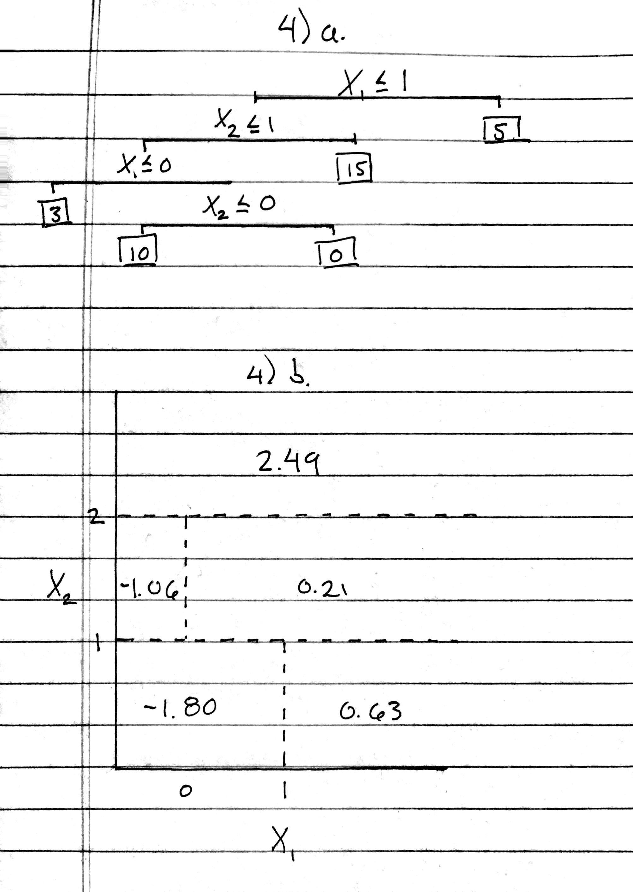

# Conceptual

## 1

(sketch on following page)


## 2

Consider the regression setting; when each tree has depth one (meaning there is only one split), each tree will only consist of one split on one attribute, and the predicted response for those two groups will be the mean response (of the training data) of those two groups. Therefore, the base model will take the form $f_j(x_j) = \beta_jI(x_{ji} \leq t) + \beta'_jI(x_{ji} > t)$, where $t$ is the value in the range of $x_j$ that dictates the split (in order to minimize the RSS). Knowing this, one can walk through algorithm 8.2, as shown below:

\begin{align}
\hat{f(x)} & = 0 \\
f_1(x_1) & = \beta_1I(x_{1i} \leq t) + \beta'_1I(x_{1i} > t) \\
\hat{f(x)} & = \hat{f(x)} + \lambda f_1(x_1) \\
r_i & = r_i - \lambda f_1(x_i) \\
f_2(x_2) & = \beta_2I(x_{2i} \leq t)  + \beta'_2I(x_{2i} > t) \\
\hat{f(x)} & = \hat{f(x)} + \lambda f_2(x_2)\\
r_i & = r_i - \lambda f_2(x_i) \\
& \vdots \\
f_j(x_j) & = \beta_jI(x_{ji} \leq t) + \beta'_jI(x_{ji} > t)\\
\hat{f(x)} & = \hat{f(x)} + \lambda f_j(x_j) \\
r_i & = r_i - \lambda f_j(x_i) \\
& \vdots \\
f(x) & = \sum_{j=1}^P f_j(X_j) ~~~ where ~~~ f_j(X_j) = \beta_jI(x_{ji} \leq t) + \beta'_jI(x_{ji} > t)\\
\end{align}

Note that $\beta_j$ is the mean of the response for all values of $x_j$ that are less than or equal to $t$, and $\beta'_j$ is the mean response for all values  of $x_j$ that are greater than $t$.

\pagebreak

## 3

```{r}
suppressPackageStartupMessages(library(ggplot2))
pm1 <- seq(0.01, 0.99, 0.01)

# defining functions
two_class_gini <- function(prob) {
    return((prob * (1-prob)) + (prob * (1-prob)))
}

two_class_entropy <- function(prob) {
    return(-1*(prob*log(prob) + (1 - prob)*log(1 - prob)))
}

class_error <- function(prob) {
    return(1 - pmax(prob, (1 - prob)))
}

# error calculation
classification_error <- class_error(pm1)
gini_error <- two_class_gini(pm1)
entropy_error <- two_class_entropy(pm1)

# bring all data together for plotting
error_df <- data.frame(x = pm1,
                       gini = gini_error,
                       class = classification_error,
                       entropy = entropy_error)

# error plot
ggplot(error_df, aes(x = x, y = gini)) +
    geom_line(aes(color = 'Gini Index')) +
    geom_line(aes(y = entropy, color = 'Cross Entropy')) +
    geom_line(aes(y = class, color = 'Classification Error')) + 
    guides(color = guide_legend(title = "Metric")) +
    ggtitle("Classification Error Rates with Varying Node Purity") +
    ylab("Error Rate") +
    xlab("Node Purity (P)")
```

## 4

(sketch on following page)



## 5

```{r}
probs <- c(0.1, 0.15, 0.2, 0.2, 0.55, 0.6, 0.6, 0.65, 0.7, 0.75)

# majority vote chooses red
majority_vote <- ifelse(probs >= 0.5, 'red', 'green')
table(majority_vote)

# average chooses green
ifelse(mean(probs) >= 0.5, 'red', 'green')
```

## 6

**Broad Strokes** - Use recursive binary splitting to continually split the data until there are fewer than $x$ training observations in each terminal node, where $x$ is predefined. The prediction for each terminal node will be the average of the response values of the training observations in that terminal node.


**Detail** - Starting with all the observations in the training set in one group, choose **the** value that, when split on, produces the lowest RSS among the two groups dictated by that split value.

\setlength{\leftskip}{1cm}

* When the data set is split into two groups, the **single prediction** for the observations that are in group A will be the mean of the response values of the observations that are in group A, and the **single prediction** for the observations that are in group B will be the mean of the response values of the observations that are in group B.

* To calculate the (training) RSS of a particular split, sum the squared  differences between the predicted value and the actual value of the response for all observations.
    
\setlength{\leftskip}{0cm}

Now the data is  parititioned into two groups. Repeat the same process again, treating each of those two groups as the *parent* group, which will be split into two *child* groups, leading to four total groups/divisions of the data set. Repeating again would lead to eight total division of the data set. Repeat this process until there are less than $x$ training observations in each terminal node. Note that if only one of the *parent* groups has more than $x$ training observations in it, but the other has less than $x$, only the group with more than $x$ would be split further (in other words, the tree doesn't have to split evenly all the way down).

# Applied

## 7

Looking at the plot below, it is clear that the testing error rate levels off after around 100 trees. Notably, as is characteristic of Random Forests, the classic "U" shape of the testing error is not present, showing a lack of overfitting as the number of trees in the ensemble increases.

\hfill

```{r}
# load libraries
suppressPackageStartupMessages(library(ISLR))
suppressPackageStartupMessages(library(MASS))
suppressPackageStartupMessages(library(randomForest))
attach(Boston)

set.seed(5)

# train test split
train <- sample(c(TRUE, FALSE), nrow(Boston), replace = TRUE)
X.train <- Boston[train, -14]
X.test <- Boston[-train, - 14]
y.train <- Boston[train, 14]
y.test <- Boston[-train, 14]

# modeling
rf.model.p <- randomForest(x = X.train,
                         y = y.train,
                         xtest = X.test,
                         ytest = y.test,
                         mtry = ncol(Boston) - 1,
                         ntree = 500)
rf.model.half_p <- randomForest(x = X.train,
                         y = y.train,
                         xtest = X.test,
                         ytest = y.test,
                         mtry = ceiling(ncol(Boston)/2),
                         ntree = 500)
rf.model.sqrt_p <- randomForest(x = X.train,
                         y = y.train,
                         xtest = X.test,
                         ytest = y.test,
                         mtry = ceiling(sqrt(ncol(Boston))),
                         ntree = 500)
rf.model.2 <- randomForest(x = X.train,
                         y = y.train,
                         xtest = X.test,
                         ytest = y.test,
                         mtry = 2,
                         ntree = 500)
# create dataframe
model.df <- data.frame(x = 1:500,
                       model_2 = rf.model.2$test$mse,
                       model_sqrt_p = rf.model.sqrt_p$test$mse,
                       model_half_p = rf.model.half_p$test$mse,
                       model_p = rf.model.p$test$mse)

# plot errors

ggplot(model.df, aes(x = x, y = model_2)) +
    geom_line(aes(y = sqrt(model_2), color = '2')) +
    geom_line(aes(y = sqrt(model_sqrt_p), color = 'sqrt(p)')) +
    geom_line(aes(y = sqrt(model_half_p), color = 'p/2')) +
    geom_line(aes(y = sqrt(model_p), color = 'p')) +
    guides(color = guide_legend(title = "No. Variables Considered")) +
    ggtitle("Predicting Median Owner-Occupied Homes") +
    xlab("Number of Trees per Model") +
    ylab("RMSE (in $1,000's")
```

## 8

* **A**.

```{r}
detach(Boston)
attach(Carseats)

# train test split
set.seed(5)
train <- sample(c(TRUE, FALSE), nrow(Carseats), replace = TRUE)
carseats.train <- Carseats[train,]
carseats.test <- Carseats[-train,]
```

\hfill

* **B**.

```{r}
suppressPackageStartupMessages(library(tree))
suppressPackageStartupMessages(library(rpart))
suppressPackageStartupMessages(library(rpart.plot))

# create two trees, one for ease-of-plotting and one for future modeling
display.tree <- rpart(Sales ~ .,
                   data = carseats.train)
model.tree <- tree(Sales ~ .,
                     data = carseats.train)

# plot the tree
prp(display.tree)

# predict with the model tree
y_hat <- predict(model.tree, newdata = carseats.test)
mse <- mean((carseats.test$Sales - y_hat)^2)
print(paste("Test MSE =", round(mse, 4)))
```

\hfill

* **C**. Looking at the plot of the cross validated error against tree size below, it appears that pruning the tree would help, albiet minorly.

```{r}
# cross validation
set.seed(2)
cv.carseats <- cv.tree(model.tree)
ggplot(data.frame(x = cv.carseats$size,
                  y = cv.carseats$dev), aes(x, y)) +
    geom_point() +
    geom_point(x = cv.carseats$size[which.min(cv.carseats$dev)],
               y = cv.carseats$dev[which.min(cv.carseats$dev)],
               color = 'red',
               shape = 'O',
               size = 6) +
    scale_x_continuous(breaks = rev(cv.carseats$size),
                       labels = rev(cv.carseats$size)) +
    geom_line(color = 'blue') +
    ggtitle("CV Error for Varying Tree Sizes") +
    xlab("Tree Size") +
    ylab("RSS")
```

\hfill

* **D**. The variable importance plot shown below indicates which variables were "most useful" in reducing child node impurity. In this case (regression), the $Increase~in~Node~Purity$ is calculated by finding the reduction in the RSS from splitting on that variable. For every split *in every tree* where $x$ variable is split on, the reduction in the RSS is recorded, and then this is averaged over all trees. 

```{r}
# bagged decision trees
bag.model <- randomForest(Sales ~ .,
                          data = carseats.train,
                          mtry = ncol(carseats.train) - 1,
                          importance = TRUE)
y_hat <- predict(bag.model, newdata = carseats.test)
mse <- mean((carseats.test$Sales - y_hat)^2)
print(paste("Test MSE =", round(mse, 4)))

# variable importance plot
var_imp_df <- data.frame(importance(bag.model))
ggplot(var_imp_df, aes(x = reorder(row.names(var_imp_df),
                                   IncNodePurity),
                       y = IncNodePurity,
                       fill = IncNodePurity)) +
    geom_bar(stat = 'identity') +
    coord_flip() +
    ggtitle("Variable Importances for Bagged Decision Trees") +
    ylab("Mean Reduction in RSS Across all Trees") +
    xlab("Variable")
```

\hfill

* **E**. Looking at the first plot below, it is clear that as the number of variables considered at each split increases, the testing MSE decreases up to a point (8, in this forest) and then increases again (although minorly).

```{r}
# test various number of attributes considered at each split
set.seed(2)
m <- c(2, 4, 6, 8, 9, 10)
errors <- rep(0, length(m))

for (i in 1:length(m)) {
    rf.model <- randomForest(Sales ~ .,
                              data = carseats.train,
                              ntree = 500,
                              mtry = m[i],
                              importance = TRUE)
    y_hat <- predict(rf.model, newdata = carseats.test)
    errors[i] <- mean((carseats.test$Sales - y_hat)^2)
}

# plot various errors
ggplot(data.frame(x = m,
                  y = errors), aes(x, y)) +
    geom_point() +
    geom_point(x = m[which.min(errors)],
               y = errors[which.min(errors)],
               col = 'red',
               shape = 'O',
               size = 6) +
    geom_line(color = 'blue') +
    scale_x_continuous(breaks = m,
                       labels = m) +
    ggtitle("Testing MSE for Various M") +
    ylab("MSE") +
    xlab("No. Variables Considered at Each Split")

# final model
rf.model <- randomForest(Sales ~ .,
                          data = carseats.train,
                          ntree = 500,
                          mtry = m[which.min(errors)],
                          importance = TRUE)
y_hat <- predict(rf.model, newdata = carseats.test)
mse <- mean((carseats.test$Sales - y_hat)^2)
print(paste("Test MSE =", round(mse, 4)))

# variable importance plot of final model
var_imp_df <- data.frame(importance(rf.model))
ggplot(var_imp_df, aes(x = reorder(row.names(var_imp_df),
                                   IncNodePurity),
                       y = IncNodePurity,
                       fill = IncNodePurity)) +
    geom_bar(stat = 'identity') +
    coord_flip() +
    ggtitle("Variable Importances for Random Forest") +
    ylab("Mean Reduction in RSS Across all Trees") +
    xlab("Variable")
```

## 9

* **A**.

```{r}
detach(Carseats)
attach(OJ)

# train test split
set.seed(5)
train <- sample(1:dim(OJ)[1], 800)
oj.train <- OJ[train, ]
oj.test <- OJ[-train, ]
```

\hfill

* **B**. The tree has 8 terminal nodes and has a misclassification error rate (given by $\frac{\sum_{i=1}^n I(y_i \neq \hat{y_1})}{n}$) is 0.17

```{r}
model.tree <- tree(Purchase ~ .,
                   data = oj.train)
summary(model.tree)
```

\hfill

* **C**. Looking at node 4 (the first terminal node, denoted by an asterisk), it is shown that any observation with a $LoyalCH$ value (numerical value symbolizing customer loyalty to the CH brand) less than 0.00589885 will be predicted to be MM (Minute Maid). There are 64 observations in the training data that are allocated to this node. There is a 94% probability of MM and conversely a 6% probability of CH.

```{r}
model.tree
```

\hfill

* **D**. As displayed by the first split on $LoyalCH$, the largest reduction in the misclassification rate is achieved by splitting on that variable. Further, both the second splits are $LoyalCH$ to increase terminal node purity. For example, if an incoming observation has $LoyalCh = 0.45$ and $PriceDiff = 0.5$, that observation would "fall" down the left hand side of the top split, then  right side of *both* the following splits.

```{r}
plot(model.tree)
text(model.tree, pretty = 0)
```

\hfill

* **E**. Looking at the confusion matrix below, the misclassification rate is $1 - Accuracy$.

```{r}
suppressPackageStartupMessages(library(caret))
y.hat <- predict(model.tree, newdata = oj.test, type = 'class')
cm <- confusionMatrix(y.hat, oj.test$Purchase)
error <- sum(cm$table[1,2], cm$table[2,1])/sum(cm$table)
print(paste("Misclassification Rate:", round(error, 4)))
```

\hfill

* **F**.

```{r}
set.seed(5)
cv.oj <- cv.tree(model.tree)
```

\hfill

* **G & H**.

```{r}
ggplot(data.frame(x = cv.oj$size,
                  y = cv.oj$dev), aes(x, y)) +
    geom_point() +
    geom_point(x = cv.oj$size[which.min(cv.oj$dev)],
               y = cv.oj$dev[which.min(cv.oj$dev)],
               color = 'red',
               shape = 'O',
               size = 6) +
    geom_line(color = 'blue') +
    scale_x_continuous(breaks = cv.oj$size,
                       labels = cv.oj$size) +
    ggtitle("CV Error for Varying Tree Sizes",
            paste("Lowest CV RSS at a Tree Size of",
                  cv.oj$size[which.min(cv.oj$dev)])) +
    xlab("Tree Size") +
    ylab("RSS")
```

\hfill

* **I**. (Although cross validation indicated a tree size of 6, I am setting the size to 4 in order to illustrate the point of the problem).

```{r}
pruned.tree <- prune.misclass(model.tree,
                              best = 4)
```

\hfill

* **J**. The unpruned tree has a (slightly) lower training misclassification error rate than the pruned tree.

```{r}
summary(pruned.tree)
summary(model.tree)
```

\hfill

* **K**. As shown below, pruning the tree to a simpler pays off when it comes to testing data. The pruned tree has 78.52% accuracy while the fully grown tree has 75.56% accuracy.

```{r}
y.hat.prune <- predict(pruned.tree, newdata = oj.test, type = 'class')
y.hat.normal <- predict(model.tree, newdata = oj.test, type = 'class')
cm.prune <- confusionMatrix(y.hat.prune, oj.test$Purchase)
cm.normal <- confusionMatrix(y.hat.normal, oj.test$Purchase)
cm.prune$overall[1]
cm.normal$overall[1]
```

## 10

* **A**.

```{r}
detach(OJ)
attach(Hitters)

# transform data set
Hitters <- Hitters[complete.cases(Hitters$Salary),]
Hitters$Salary <- log(Hitters$Salary)
```

\hfill

* **B**.

```{r}
hitters.train <- Hitters[1:200,]
hitters.test <- Hitters[201:nrow(Hitters),]
```

\hfill

* **C & D**.

```{r}
suppressPackageStartupMessages(library(gbm))
set.seed(1)


# fit boosted model
lambdas <- seq(0.001, 0.1, 0.001)
train.errors <- rep(0, length(lambdas))
test.errors <- rep(0, length(lambdas))
for (i in 1:length(lambdas)) {
    hitters.boost <- gbm(Salary ~ .,
                         data = hitters.train,
                         distribution = 'gaussian',
                         n.trees = 1000,
                         shrinkage = lambdas[i])
    train.y.hat <- predict(hitters.boost,
                     newdata = hitters.train,
                     n.trees = 1000)
    test.y.hat <- predict(hitters.boost,
                 newdata = hitters.test,
                 n.trees = 1000)
    train.errors[i] <- mean((train.y.hat - hitters.train$Salary)^2)
    test.errors[i] <- mean((test.y.hat - hitters.test$Salary)^2)
}

# plot results
ggplot(data.frame(x = lambdas,
                  train = train.errors,
                  test = test.errors), aes(x , test)) +
    geom_line(aes(y = train, color = "Train MSE")) +
    geom_line(aes(y = test, color = "Test MSE")) +
    ggtitle("Salary Prediction Errors") +
    xlab("Lambda") +
    ylab("Error Rate")
```

\hfil

* **E**.

```{r}
suppressPackageStartupMessages(library(glmnet))

# create training and testing matrices
x.train <- model.matrix(Salary ~ .,
                        data = hitters.train)[,-1]
y.train <- hitters.train$Salary
x.test <- model.matrix(Salary ~ .,
                       data = hitters.test)[,-1]
y.test <- hitters.test$Salary

# ridge regression
ridge.model <- glmnet(x.train,
                      y.train,
                      alpha = 0)
ridge.y.hat <- predict(ridge.model, newx = x.test)
ridge.mse <- mean((ridge.y.hat - y.test)^2)
    
# lasso regression
lasso.model <- glmnet(x.train,
                      y.train,
                      alpha = 1)
lasso.y.hat <- predict(lasso.model, newx = x.test)
lasso.mse <- mean((lasso.y.hat - y.test)^2)

# final boosted model
boosted.model <- gbm(Salary ~ .,
                     data = hitters.train,
                     distribution = 'gaussian',
                     n.trees = 1000,
                     shrinkage = lambdas[which.min(test.errors)])
boosted.y.hat <- predict(boosted.model,
                         newdata = hitters.test,
                         n.trees = 1000)
boosted.mse <- mean((boosted.y.hat - hitters.test$Salary)^2)


print(paste("Boosted regression trees testing MSE |", round(boosted.mse, 4)))
print(paste("Lasso regression testing MSE |", round(lasso.mse, 4)))
print(paste("Ridge regression testing MSE |", round(ridge.mse, 4)))
```

\hfill

* **F**. $CAtbat$ is the most important variable in the boosted model, which equates to the number of times a player was at bat during his career.

```{r}
# variable importance plot
summary(boosted.model)
```

\hfill

* **G**.

```{r}
bag.model <- randomForest(x = x.train,
                          y = y.train,
                          xtest = x.test,
                          ytest = y.test,
                          ntree = 1000,
                          mtry = ncol(x.train))
print(paste("Bagged regression trees testing MSE |", round(mean(bag.model$test$mse), 4)))
```