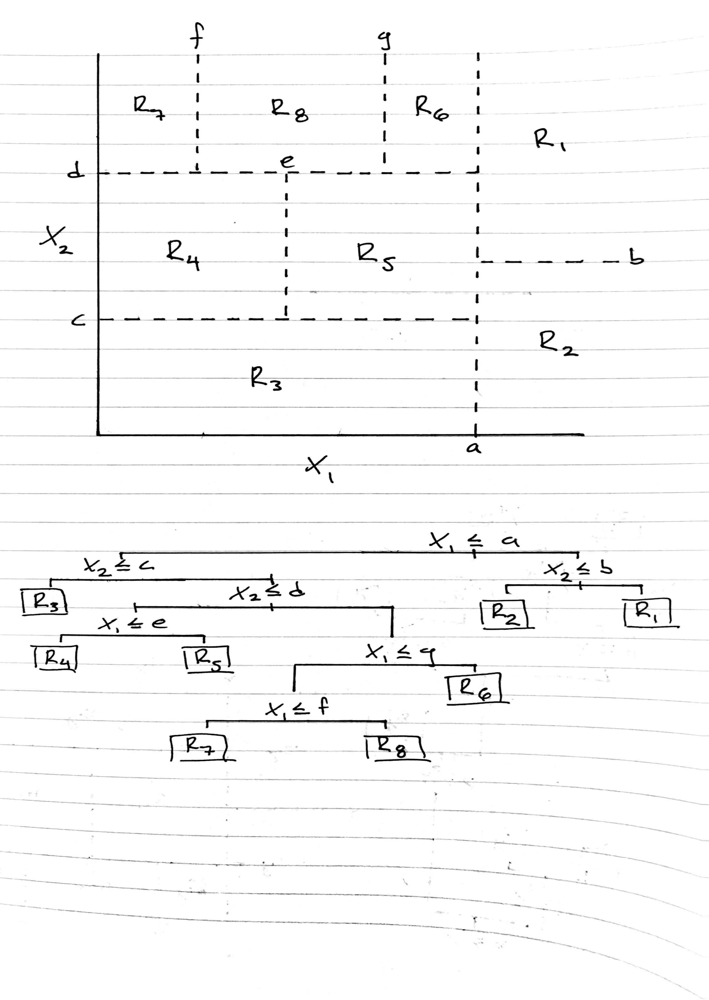

# Conceptual

## 1

(sketch on following page)



## 2

Consider the regression setting; when each tree has depth one (meaning there is only one split), each tree will only consist of one split on one attribute, and the predicted response for those two groups will be the mean response (of the training data) of those two groups. Therefore, the base model will take the form $f_j(x_j) = \beta_jI(x_{ji} \leq t) + \beta'_jI(x_{ji} > t)$, where $t$ is the value in the range of $x_j$ that dictates the split (in order to minimize the RSS). Knowing this, one can walk through algorithm 8.2, as shown below:

\begin{align}
\hat{f(x)} & = 0 \\
f_1(x_1) & = \beta_1I(x_{1i} \leq t) + \beta'_1I(x_{1i} > t) \\
\hat{f(x)} & = \hat{f(x)} + \lambda f_1(x_1) \\
r_i & = r_i - \lambda f_1(x_i) \\
f_2(x_2) & = \beta_2I(x_{2i} \leq t)  + \beta'_2I(x_{2i} > t) \\
\hat{f(x)} & = \hat{f(x)} + \lambda f_2(x_2)\\
r_i & = r_i - \lambda f_2(x_i) \\
& \vdots \\
f_j(x_j) & = \beta_jI(x_{ji} \leq t) + \beta'_jI(x_{ji} > t)\\
\hat{f(x)} & = \hat{f(x)} + \lambda f_j(x_j) \\
r_i & = r_i - \lambda f_j(x_i) \\
& \vdots \\
f(x) & = \sum_{j=1}^P f_j(X_j) ~~~ where ~~~ f_j(X_j) = \beta_jI(x_{ji} \leq t) + \beta'_jI(x_{ji} > t)\\
\end{align}

Note that $\beta_j$ is the mean of the response for all values of $x_j$ that are less than or equal to $t$, and $\beta'_j$ is the mean response for all values  of $x_j$ that are greater than $t$.

\pagebreak

## 3

```{r}
suppressPackageStartupMessages(library(ggplot2))
pm1 <- seq(0.01, 0.99, 0.01)

# Defining functions
two_class_gini <- function(prob) {
    return((prob * (1-prob)) + (prob * (1-prob)))
}

two_class_entropy <- function(prob) {
    return(-1*(prob*log(prob) + (1 - prob)*log(1 - prob)))
}

class_error <- function(prob) {
    return(1 - pmax(prob, (1 - prob)))
}

# error calculation
classification_error <- class_error(pm1)
gini_error <- two_class_gini(pm1)
entropy_error <- two_class_entropy(pm1)

# bring all data together for plotting
error_df <- data.frame(x = pm1,
                       gini = gini_error,
                       class = classification_error,
                       entropy = entropy_error)

# Error plot
ggplot(error_df, aes(x = x, y = gini)) +
    geom_line(aes(color = 'Gini Index')) +
    geom_line(aes(y = entropy, color = 'Cross Entropy')) +
    geom_line(aes(y = class, color = 'Classification Error')) + 
    guides(color = guide_legend(title = "Metric")) +
    ggtitle("Classification Error Rates with Varying Node Purity") +
    ylab("Error Rate") +
    xlab("Node Purity (P)")
```